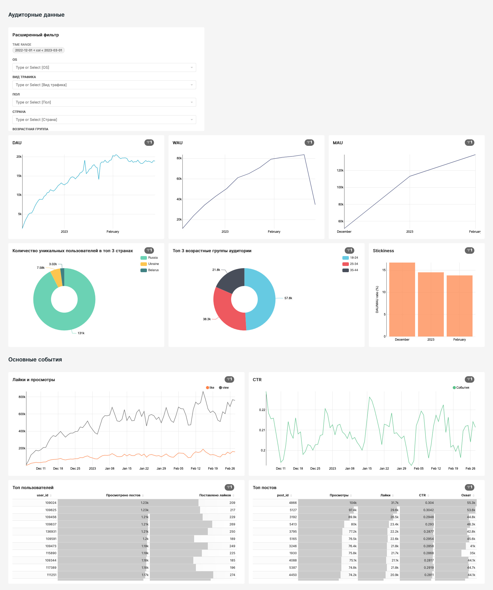
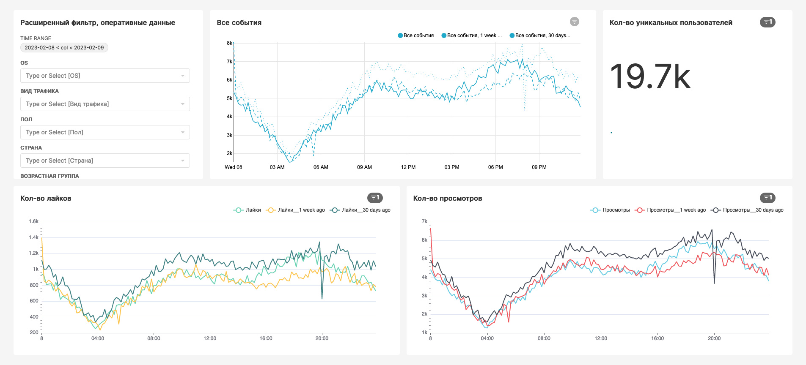
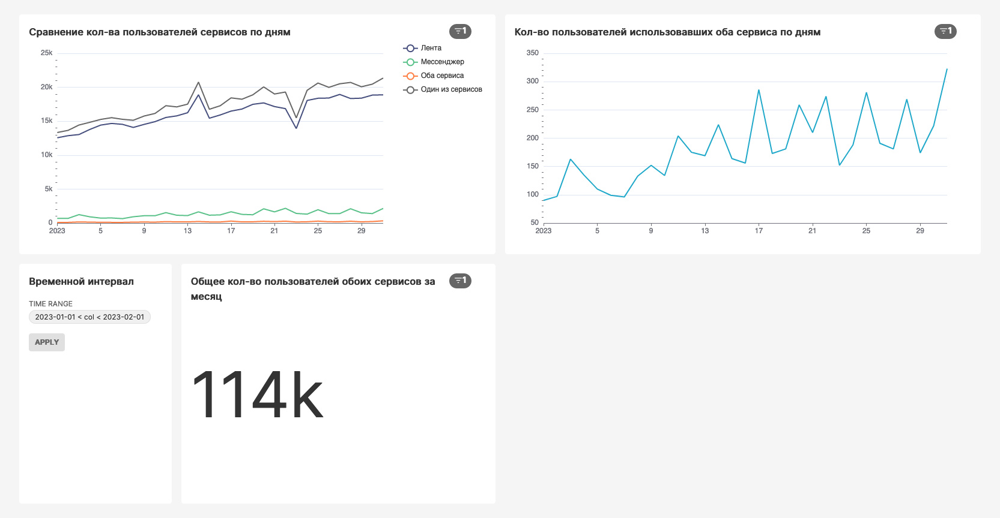
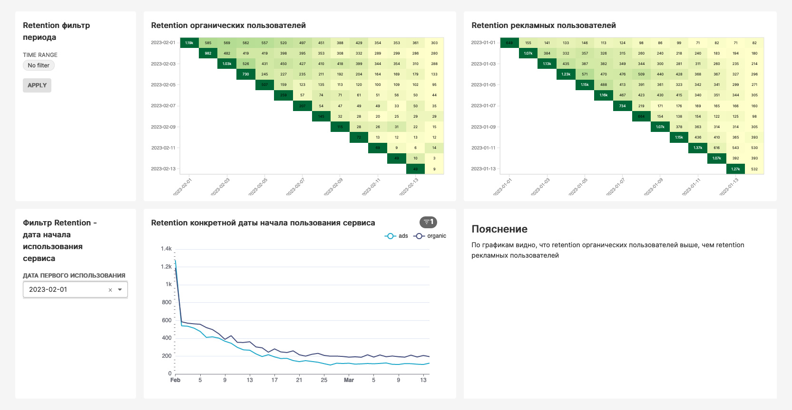
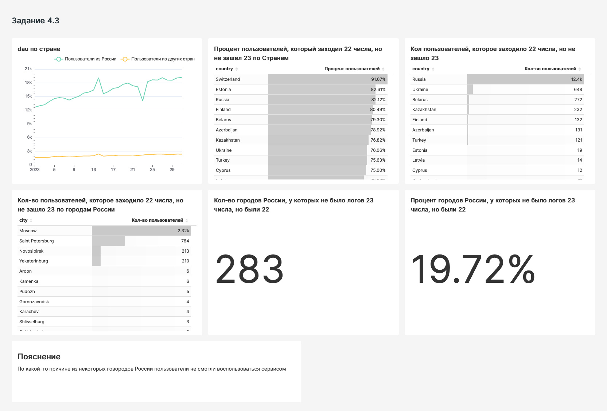
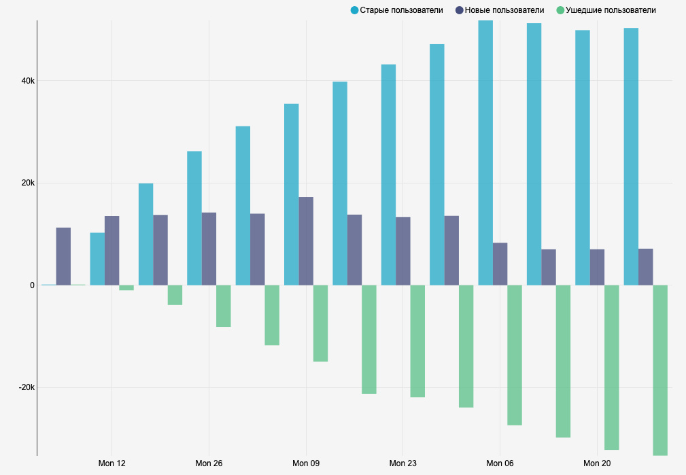

## Построение трех базовых дашбордов продукта

Для начала я построил базовый дашборд ("лента новостей - основное"), который отвечает на вопрос "сколько", т.е. отображает основные ключевые аудиторные метрики и ключевые события нашего продукта (ленты новостей).

Далее я построил дашборд с оперативными данными за день ("лента-новостей-оперативные-данные"), который отражает ключевые метрики сервиса ленты новостей за текущий день.

На следующем этапе я рассмотрел взаимодействие двух сервисов: ленты новостей и мессенджера, рассчитал сколько пользователей использует каждый сервис отдельно и сколько из них использует оба сервиса. 

## Другие дашборды

Далее я сравнил retention пользователей, которые пришли через платный трафик и тех, кто пришел через органические каналы:

На следующем этапе я оценил retention пользователей после проведенной рекламной кампании:

Потом проанализировал падение активной аудитории в один из дней:

В конце я построил график retention, который позволяет посмотреть на активную аудиторию с точки зрения новых, старых и ушедших пользователей:

