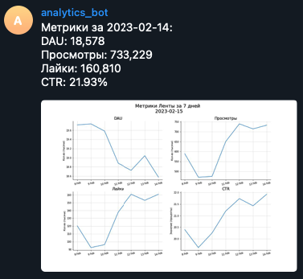

## Автоматизация отчетности

Для начала я автоматизировал базовую отчетность сервиса ленты новостей. Для этого, я сделал автоматическую отправку аналитической сводки по ключевым метрикам сервиса в телеграм каждый день. Пример отчета выглядит следующим образом:

Далее я автоматизировал отправку отчета по работе всего приложения. Сначала идет текстовое описание изменения метрик:

Далее идут графики с изменениями метрик по все приложению:

Далее идет графики изменения метрик сервиса мессенджера:

А далее идут графики изменения метрик ленты новостей:

