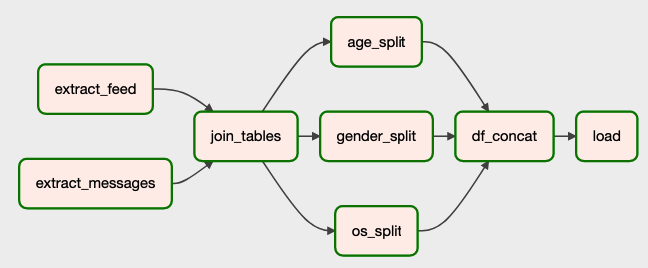

## Построение ETL пайплайна

В данном задании я построил ETL pipeline, в котором параллельного обрабатываются две таблицы. Сначала из каждой таблицы выгружаются определенные метрики по каждому пользователю о его взаимодействии с каждым из сервисов. Далее получившиеся результаты объединяются в одну таблицу. Далее все метрики считаются в разрезе по полу, возрасту и ос. Потом финальные данные со всеми метриками записываются в отдельную таблицу в Clickhouse. Каждый день таблица дополняется новыми данными.

Так выглядит граф выполнения данного пайплайна:

А вот пример записей, которые добавляются в таблицу каждый день:

